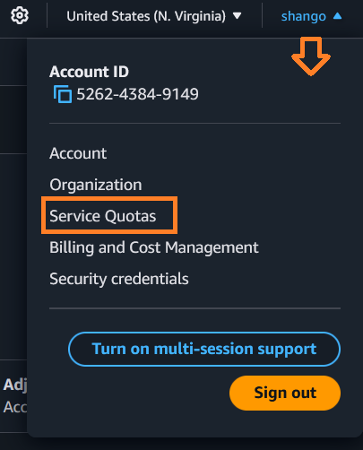
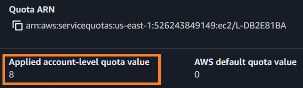
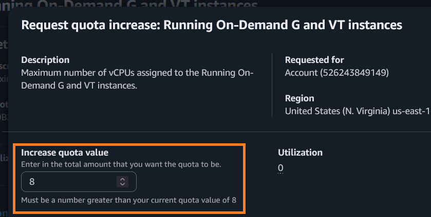
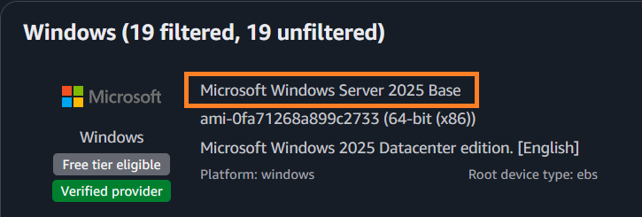
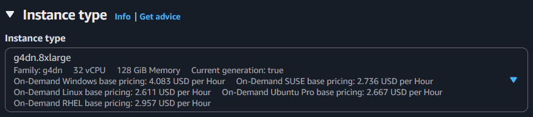
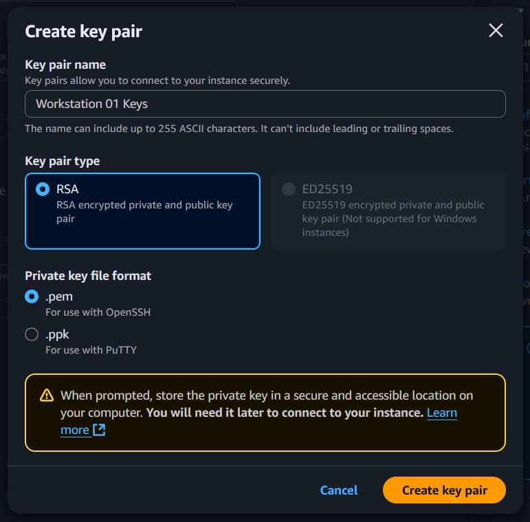
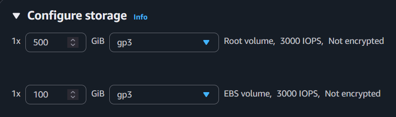

# Deploying a Remote VFX Workstation on AWS

## Introduction

As visual effects (VFX) studios shift toward more distributed and flexible production models, cloud-based workstations are becoming a practical alternative to traditional on-premises setups. This guide walks you through the process of deploying a high-performance, production-ready compositing workstation on Amazon Web Services (AWS), accessible remotely via Amazon DCV, ready for the installation of your preferred compositing software.

## What This Guide Covers

By the end of this guide, you will have:

- Selected and launched an appropriate EC2 instance
- Requested AWS service quota increases
- Deployed a Windows Server AMI and configured system settings
- Provisioned a high-speed cache volume for media playback
- Configured an Elastic IP for consistent remote access
- Installed NVIDIA GRID drivers
- Set up NICE DCV for secure remote access with audio support
- Optimized the instance for VFX workloads

## Who This Guide Is For

This guide is intended for compositors, pipeline engineers, or technical directors with intermediate to advanced experience in:

- AWS administration
- Windows VFX workstation requirements
- Windows PowerShell usage

## Prerequisites

Before beginning, ensure you have:

- An active AWS account with billing information set up
- Administrator access to your AWS account
- An internet connection with at least 15 Mbps download/upload speed
- A local computer with permissions to install the NICE DCV client
- Basic familiarity with Windows Server administration

## Request Quota Increases

Many GPU-enabled instances require quota increases before you can launch them:

1. Sign in to the AWS Management Console and navigate to the **EC2** dashboard.

2. In the upper right-hand corner of the page, choose a geographic region closest to your user base (e.g., `us-west-1` for United States (N. California)).

   
   > *Figure 1. Region set to 'United States (N. California)'*

3. From the **User Account** drop-down menu (labeled with your account name in the top-right corner), choose **Service Quotas**.

   
   > *Figure 2. User Account drop-down showing Service Quotas link*

4. On the **Service Quotas** page, select **AWS services** from the left navigation panel.

5. In the search bar, type "EC2" and select **Amazon Elastic Compute Cloud (Amazon EC2)** from the results.

6. In the service quotas search bar, type "G instances" and select **Running On-Demand G and VT Instances**.

   You'll see your current quota displayed under **Applied account-level quota value**.

   
   > *Figure 3. The current Service Quota value is highlighted*

7. If your current quota is less than 32 vCPUs, click the **Request increase at account level** button.

8. Set the **Increase quota value** to at least 32 vCPUs to support the g4dn.8xlarge instance.

   
   > *Figure 4. Setting quota increase value*

9. Provide a brief justification for your request (e.g., "Deploying VFX workstation for remote production") and submit the request.

10. AWS typically processes quota increase requests within 24-48 hours. You'll receive an email notification when your request is approved.

## Launch and Configure an EC2 Windows Server Instance

After your quota increase is approved, you can launch your workstation instance:

1. From the AWS dashboard, navigate to the EC2 dashboard and click **Launch Instance**.

2. In the **Name and tags** section, enter a descriptive name for your instance (e.g., "VFX-Workstation-01").

3. Under **Application and OS Images (Amazon Machine Image)**, click the "Quick Start" tab, search for "Windows," and select **Microsoft Windows Server 2025 Base**.

   
   > *Figure 5. Microsoft Windows Server 2025 Base selected*

4. Under **Instance type**, search for and select **g4dn.8xlarge**. This instance provides a good balance of GPU power (1 NVIDIA T4 GPU), CPU resources (32 vCPUs), memory (128 GB), and network performance for high-end compositing work.

   
   > *Figure 6. g4dn.8xlarge instance type selected*

5. Under **Key pair (login)**, create a new key pair:

   - Click **Create new key pair**
   - Enter a recognizable name (e.g., "vfx-workstation-keypair")
   - Select **RSA** as the Key pair type
   - Choose **PEM** as the Private key file format
   - Click **Create key pair**

   
   > *Figure 7. Creating a new key pair*

   **Important**: The **private key file (.pem)** will automatically download to your computer. Store this file in a secure location; you'll need it to retrieve the administrator password for your Windows instance.

6. Under **Network settings**, click **Edit** and configure:

   - Leave VPC and subnet at default values unless you have specific networking requirements
   - Set **Auto-assign public IP** to **Enable**
   - Under **Firewall (security groups)**, select **Create a new security group**
   - Name your security group (e.g., "vfx-workstation-sg")
   - Ensure these inbound rules exist:
     - RDP (port 3389) from your IP address
     - Custom TCP (port 8443) from your IP address for NICE DCV

7. Under **Configure storage**, set up your storage volumes:

   - Increase the **Root volume** (C: drive) size from 30 GB to **500 GB**
   - Leave the volume type as **gp3** (General Purpose SSD)

8. Click **Add new volume** to create a cache volume:
   - Set the size to **1000 GB** (1 TB)
   - Set the volume type to **gp3**

   
   > *Figure 8. Configured root and cache volumes*

9. Review your selections and click **Launch instance**.

10. Wait for the instance to initialize (this typically takes 5-10 minutes).

## Allocate and Associate an Elastic IP

An Elastic IP provides a static public IP address, ensuring your workstation remains accessible at the same address even after restarts:

1. In the EC2 console, select **Elastic IPs** from the left navigation panel under "Network & Security."

2. Click **Allocate Elastic IP address**.

3. Leave the default settings and click **Allocate**.

4. Select the newly allocated Elastic IP, then click **Actions** → **Associate Elastic IP address**.

5. Under **Resource type**, select **Instance**.

6. Select your VFX workstation instance from the **Instance** dropdown.

7. Click **Associate**.

## Connect to Your Windows Instance

1. In the EC2 console, select your running instance.

2. Click **Connect** at the top of the page.

3. Select the **RDP client** tab.

4. Click **Get password** and upload your **.pem key file** when prompted.

5. Copy the decrypted password.

6. Use an RDP client (like Remote Desktop Connection on Windows) to connect to your instance using:
   - The Elastic IP address you associated with your instance
   - Username: Administrator
   - Password: (the decrypted password)

7. Accept any security certificates when prompted.

## Install NVIDIA GRID Drivers

To enable GPU acceleration for your VFX applications:

1. After connecting to your Windows instance, open **Windows PowerShell** as Administrator.

2. Execute the following commands to install the AWS Command Line Interface (CLI):

   ```
   Invoke-WebRequest -Uri "https://awscli.amazonaws.com/AWSCLIV2.msi" -OutFile "AWSCLIV2.msi"
   Start-Process msiexec.exe -Wait -ArgumentList "/i AWSCLIV2.msi"
   
   ```

3. Configure the AWS CLI with the following command:

   ```PowerShell
   aws configure
   ```

4. When prompted, enter your AWS login credentials.

5. For the **Default Region**, enter the region you set when creating the instance.

6. Download the NVIDIA drivers using the following command:

   ```PowerShell
   aws s3 cp --recursive s3://ec2-windows-nvidia-drivers/latest/ .
   ```

7. After the download completes, navigate to your current directory and run the installation file with a .exe extension.

8. Follow the installation wizard, accepting the default options.

9. When installation is complete, restart your instance.

## Format the Cache Volume

1. In your Windows instance, open the Start menu and type "disk management", then select **Create and format hard disk partitions**.

2. Locate the unallocated 1000 GB disk.

3. Right-click on the unallocated space and select **New Simple Volume**.

4. Follow the wizard, accepting the defaults for volume size.

5. Assign drive letter **D:** or another preferred letter.

6. Format the volume with the NTFS file system and set the allocation unit size to **64K** (optimized for large media files).

7. Name the volume **Cache**.

8. Complete the wizard to format the drive.

## Set Up NICE DCV for Remote Access

NICE DCV provides a secure, high-performance remote desktop experience optimized for graphics-intensive applications:

1. Open a web browser on your Windows instance and navigate to https://download.nice-dcv.com/

2. Download the latest NICE DCV Server for Windows.

3. Run the installer and follow the installation wizard:
   - Accept the license agreement
   - Choose **Install for anyone using this computer**
   - Select **Typical** installation
   - Click **Install**

4. After installation completes, restart your instance.

5. Log back in using RDP.

6. Open the Windows Start menu, search for "dcv", and open **NICE DCV Server Console**.

7. In the **DCV Server Console**:
   - Go to the **Security** tab
   - Enable **QUIC** protocol support
   - Under **Authentication**, ensure **Password** is enabled
   - Click **Apply**

   
   > *Figure 9. NICE DCV Server Console security settings*

8. On your local computer, download and install the NICE DCV Client from https://download.nice-dcv.com/

9. Launch the DCV Client and connect to your instance:
   - Enter your Elastic IP address followed by port 8443 (e.g., `your-elastic-ip:8443`)
   - Username: Administrator
   - Password: (your Windows administrator password)

   
   > *Figure 10. NICE DCV Client connection dialog*

## Enable Audio Playback

To ensure audio playback works properly in your remote session:

1. In your DCV session, right-click the Windows Start button and select **Computer Management**.

2. Navigate to **Services and Applications** → **Services**.

3. Find and double-click **Windows Audio**.

4. Set the **Startup type** to **Automatic**.

5. Click **Start** if the service isn't already running.

6. Click **OK** to save changes.

7. In the NICE DCV Client on your local machine:
   - Click the settings icon in the top-right corner
   - Select **Settings**
   - Go to the **Audio** tab
   - Ensure **Enable audio** is checked
   - Click **OK**

8. Test audio playback by opening a media file or browser page with audio content.

   
   > *Figure 11. NICE DCV Client audio settings*

## Optimize the Workstation for VFX Performance

1. **Adjust Visual Effects Settings**:
   - Right-click on **This PC** and select **Properties**
   - Click **Advanced system settings**
   - In the **Performance** section, click **Settings**
   - Select **Adjust for best performance**
   - Click **OK**

2. **Configure Power Settings**:
   - Search for "power" in the Start menu and select **Power & sleep settings**
   - Click **Additional power settings**
   - Select **High performance**
   - Click **Change plan settings** → **Change advanced power settings**
   - Expand **PCI Express** → **Link State Power Management**
   - Set to **Off**
   - Click **OK**

3. **Disable Unnecessary Services**:
   - Press **Win+R**, type `msconfig`, and press Enter
   - Go to the **Services** tab
   - Check **Hide all Microsoft services**
   - Disable any remaining non-critical services
   - Go to the **Startup** tab and click **Open Task Manager**
   - Disable all unnecessary startup items
   - Restart your instance

4. **Configure Virtual Memory**:
   - Right-click on **This PC** and select **Properties**
   - Click **Advanced system settings**
   - In the **Performance** section, click **Settings**
   - Go to the **Advanced** tab
   - Under **Virtual memory**, click **Change**
   - Uncheck **Automatically manage paging file size for all drives**
   - For the OS drive (C:), select **Custom size**:
     - Initial size: 16384 MB (16 GB)
     - Maximum size: 32768 MB (32 GB)
   - For the Cache drive (D:), select **No paging file**
   - Click **OK** on all dialogs
   - Restart when prompted

   
   > *Figure 12. Virtual memory optimization settings*

## Install Your VFX Software

Now your AWS workstation is ready for you to install your preferred compositing software:

1. Download your VFX software installer to the instance.

2. Follow the software's installation instructions.

3. Configure your software to use the D: drive for cache and temporary files.

4. Test the software with sample projects to verify performance.

## Security Best Practices

1. **Update Windows Regularly**:
   - Enable automatic Windows updates
   - Schedule regular maintenance windows for updates

2. **Implement Stricter Security Groups**:
   - Limit access to your specific IP address
   - Consider setting up a VPN for additional security

3. **Create Regular AMI Backups**:
   - After your workstation is configured, create an Amazon Machine Image (AMI)
   - Create regular backups of your work

4. **Consider AWS Instance Scheduling**:
   - To save costs, consider stopping the instance when not in use
   - Use AWS Instance Scheduler or similar tools to automate this process

## Troubleshooting

### Poor Remote Connection Performance
- Verify your local internet connection speed
- Test with a wired connection instead of Wi-Fi
- Adjust DCV client settings for lower bandwidth if needed
- Consider changing your EC2 instance region to one closer to your location

### GPU Not Recognized
- Verify NVIDIA driver installation in Device Manager
- Ensure your quota increase was approved
- Check instance type is g4dn.8xlarge

### High Latency or Lag
- Check your security group allows traffic on port 8443
- Verify no firewall is blocking connections
- Try reducing the display quality in DCV settings

## Cost Optimization Tips

1. Stop your instance when not in use (you'll still pay for storage)
2. Consider purchasing a Reserved Instance for long-term projects
3. Monitor your AWS billing dashboard regularly
4. Set up billing alerts to notify you of unexpected charges

---

Version 1.2 — May 2025